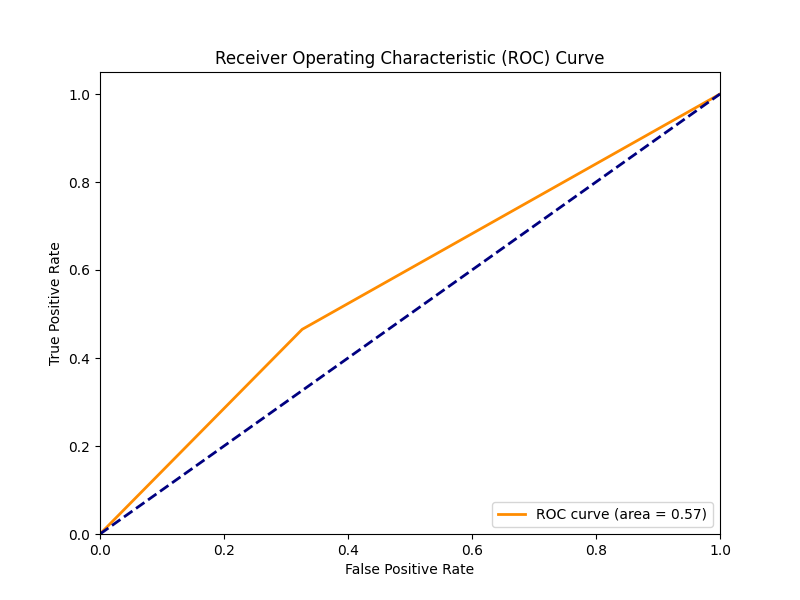

## SIL765: Networks and System Security 
### Course Project:  ADAPTIVE SCHEME SELECTION FOR SECURE IMAGE TRANSMISSION IN ENCRYPTION-THEN- COMPRESSION SYSTEMS


Kushagra Gupta (2021CS50592) and Parth Patel (2021CS10550)

## Directory structure

        .
        ├── SPIHT-Compression-Scheme
        │   ├── src
        │   │   ├── ..
        │   │   └── ..
        │   └── ..
        ├── parse.py
        ├── decision_tree_model.pkl
        ├── roc_curve.png
        ├── parameters.txt
        └── data_new.zip
        
The SPHIT Image Compression directory contains the source files for SPHIT Image Compression.

The parse.py has the function which trains our decision tree classifier, as well as the SVD Image Compression source.

The decision_tree_model.pkl is the decision tree classifier, and the parameters.txt file contains the trained parameters.



### The ROC Curve of our trained model.


-------------------------------------------
SPHIT Image Compression Implementation
-------------------------------------------

We acknowledge the ImShrinker developers for their valuable contributions:
### imshrinker
ImShrinker - SPIHT algorithm implementation

**Created by René Puchinger in 2008 (revised in 2013).**

A minimal implementation (console only) of the SPIHT (Set Partitioning in Hierarchical Trees) algorithm as presented in the paper
"A new, fast, and efficient image codec based on set partitioning in hierarchical trees" by A. Said and W. A. Pearlman
(IEEE Transactions on Circuits and Systems for Video Technology, 6 (1996), pp. 243 - 250).

**The code is intended for educational purposes only.**

Compilation
-----------
To build the application you can use the GNU C++ Compiler:
```
g++ *.cpp -o imshrinker
```

Usage
-----
```
imshrinker [c[bpp]|d] [file_in] [file_out]
```

Where:

 c[bpp] - compress with bit rate bpp (default: bpp = 0.5)

 d      - decompress

Example:
```
imshrinker c0.1 image.ppm image.ims
imshrinker d image.ims image_new.ppm
```

This will compress the file image.ppm with the bitrate of 0.1 bpp and then decompress it back.

The application supports raw grayscale and raw color images (PGM, PPM) as and input file. You can convert any image to the PGM or PPM format in GIMP.

Benchmark
---------
Benchmark is included in the attached article spiht.pdf.

Bibliography
------------
(in BibTeX notation)

@Book{Rao+98,
  title     = {Wavelet Transforms - Introduction to Theory and Applications},
  author    = {R. M. Rao and A. S. Bopardikar},
  publisher = {Addison Wesley},
  year      = {1998}
}

@article{Said+96,
        AUTHOR = "A. Said and W. A. Pearlman",
        TITLE = "A New, Fast, and Efficient Image CODEC Based on Set Partitioning in Hierarchical Trees",
        JOURNAL = "IEEE Transactions on Circuits and Systems for Video Technology",
        VOLUME = "6",
        YEAR = "1996",
        NUMBER = "3",
        MONTH = "June",
        PAGES = "243-250"
}

@Book{Sayood00,
  title     = {Introduction to Data Compression},
  author    = {K. Sayood},
  publisher = {Morgan Kaufmann},
  year      = {2000},
  EDITION = {Second}
}

@Book{Salomon04,
  title     = {Data Compression - The Complete Reference},
  author    = {D. Salomon},
  publisher = {Springer Verlag},
  year      = {2004},
  EDITION = {Third}
}
